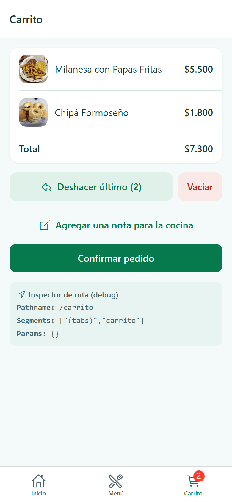
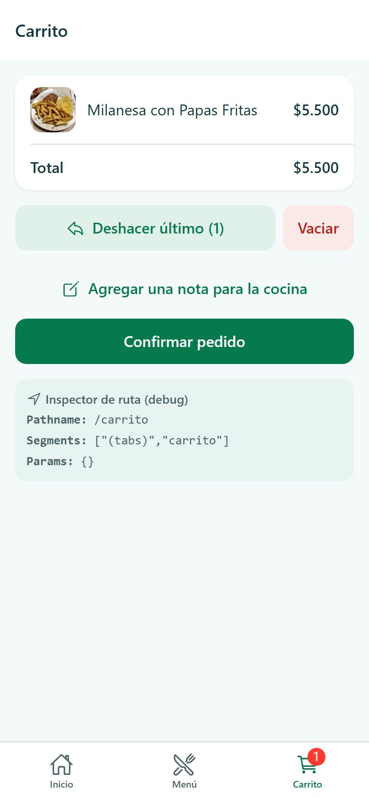
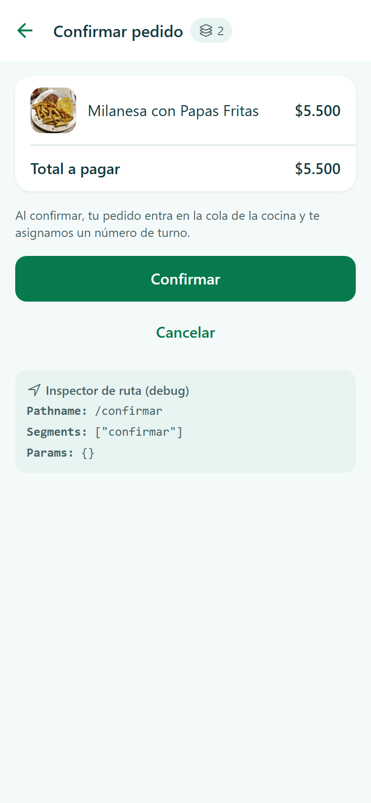
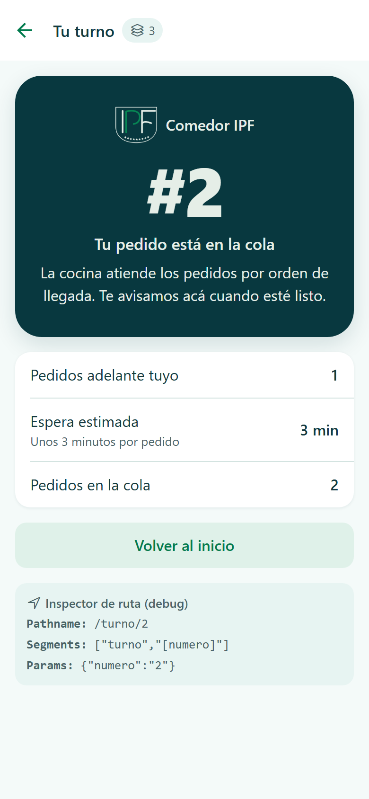
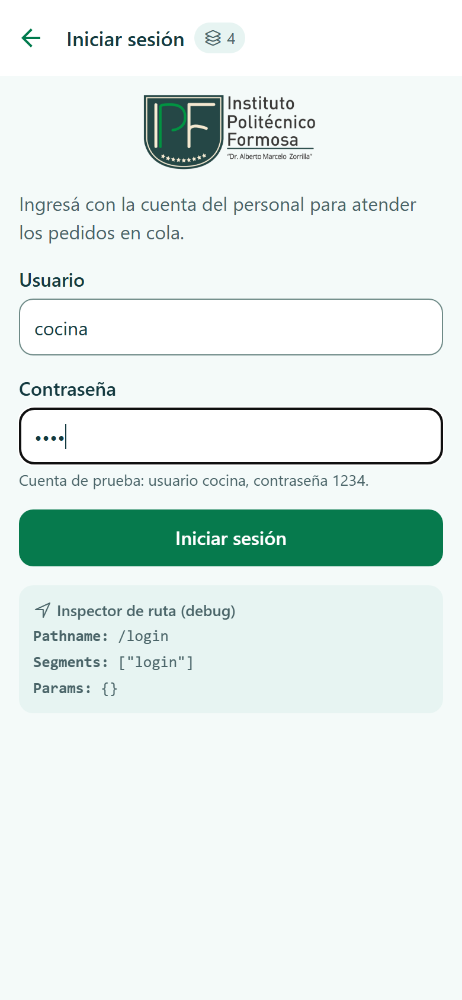
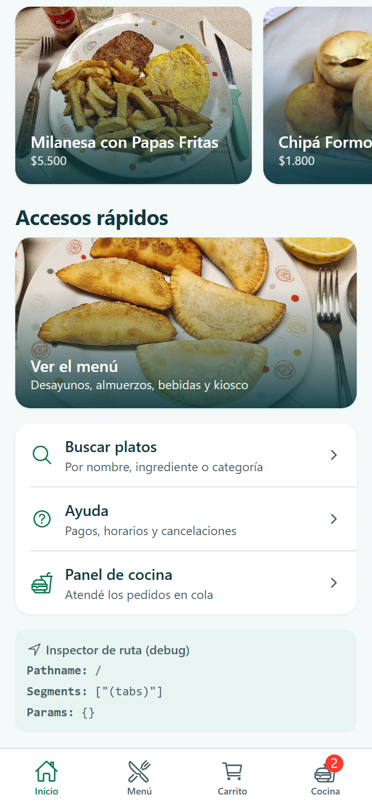
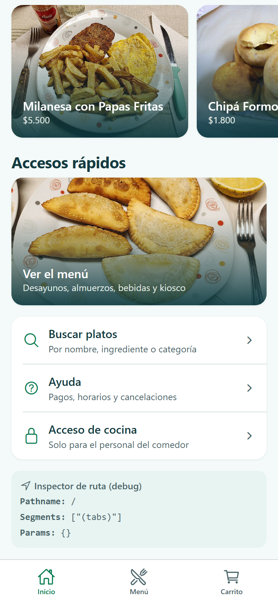
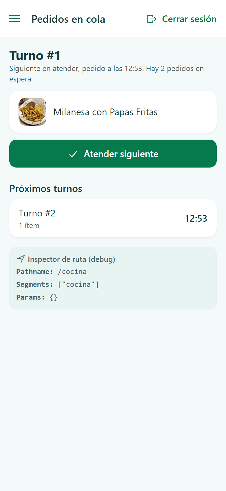
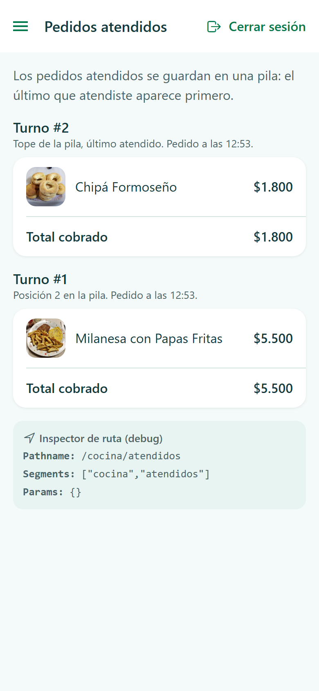
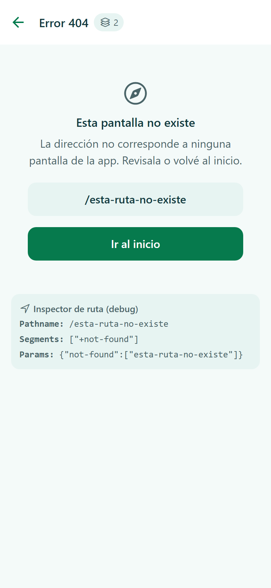

# Comedor IPF 🍽️ - App de Pedidos

**Alumno:** Rodriguez, Gonzalo

Aplicación móvil desarrollada con **React Native**, **Expo Router (SDK 57)** y **TypeScript** para el Comedor del Instituto Politécnico Formosa.

El sistema combina dos estructuras de datos desarrolladas a medida:
* **Cola (FIFO):** Para el procesamiento de los pedidos de comida en la cocina en orden estricto de llegada sin permitir que nadie se cuele.
* **Pila (LIFO):** Para la función de "Deshacer último plato" en el carrito y para el historial de pedidos atendidos en la cocina.

---

## 📁 Árbol de Carpetas (`src/app`) y Navegadores

```text
src/
├── app/
│   ├── _layout.tsx                     -> Stack Raíz (Context, GestureHandlerRootView, Stack.Protected, unstable_settings)
│   ├── (tabs)/
│   │   ├── _layout.tsx                 -> Navegador Tabs (Inicio, Menú, Carrito) con Badge de ítems y pestaña Cocina protegida
│   │   ├── index.tsx                   -> Ruta '/' (Pestaña Inicio: saludo y accesos rápidos)
│   │   ├── personal.tsx                -> Ruta '/personal' (Pestaña Cocina, solo con sesión: Tabs.Protected)
│   │   ├── menu/
│   │   │   ├── _layout.tsx             -> Stack interno de la pestaña Menú
│   │   │   ├── index.tsx               -> Ruta '/menu' (Lista de platos por categoría)
│   │   │   └── [id].tsx                -> Ruta '/menu/[id]' (Detalle del plato con validación y título dinámico)
│   │   └── carrito/
│   │       ├── _layout.tsx             -> Stack interno de la pestaña Carrito
│   │       ├── index.tsx               -> Ruta '/carrito' (Pila de deshacer, total, nota y confirmación)
│   │       └── nota.tsx                -> Ruta '/carrito/nota' (Hoja inferior formSheet para nota a cocina)
│   ├── categorias/
│   │   └── [categoria].tsx             -> Ruta '/categorias/[categoria]' (Stack raíz: filtro por categoría)
│   ├── buscar.tsx                      -> Ruta '/buscar' (Stack raíz: buscador con query params en URL)
│   ├── confirmar.tsx                   -> Ruta '/confirmar' (Stack raíz: modal de confirmación)
│   ├── turno/
│   │   └── [numero].tsx                -> Ruta '/turno/[numero]' (Stack raíz: ticket de turno y espera estimada)
│   ├── login.tsx                       -> Ruta '/login' (Stack raíz: modal protegido para sin sesión)
│   ├── cocina/
│   │   ├── _layout.tsx                 -> Navegador Drawer (solo con sesión iniciada)
│   │   ├── index.tsx                   -> Ruta '/cocina' (Frente de cola y botón desencolar)
│   │   └── atendidos.tsx               -> Ruta '/cocina/atendidos' (Pila de historial de atendidos)
│   ├── ayuda/
│   │   ├── index.tsx                   -> Ruta '/ayuda' (Índice de ayuda)
│   │   └── [...slug].tsx               -> Ruta '/ayuda/...' (Catch-all para artículos de ayuda)
│   ├── pedido.tsx                      -> Ruta '/pedido' (Redirección <Redirect href="/carrito" />)
│   └── +not-found.tsx                  -> Pantalla 404 para URLs inexistentes
├── components/
│   ├── DondeEstoy.tsx                  -> Inspector de ruta DEBUG (usePathname, useSegments, useLocalSearchParams)
│   ├── TarjetaPlato.tsx                -> Componente reutilizable para platos
│   └── TituloConPila.tsx               -> Título de header con el contador de pantallas en la pila (useNavigation().getState())
│   (más los componentes de interfaz compartidos: Pantalla, Boton, Presionable, Grupo, FilaEnlace,
│    FilaDato, Campo, Chip, NotaCocina, EstadoVacio, ImagenPlato, RejillaPlatos, TarjetaFoto, Carrusel,
│    HeroMarca, Marca, BotonAgregar, BarraCarrito, TicketTurno, Movimiento y Diseno)
├── tema/
│   └── tokens.ts                       -> Sistema de diseño: colores, espaciado, tipografía, radios, sombras,
│                                          animaciones (movimiento), puntos de quiebre (diseno) y formatoPrecio()
├── context/
│   └── ComedorContext.tsx              -> Contexto global (sesión, carrito, Pila de deshacer, Cola de pedidos)
├── data/
│   └── platos.ts                       -> 12 platos de ejemplo distribuidos en 4 categorías
└── estructuras/
    ├── Pila.ts                         -> Clase Pila con #items privada, tamanio, aArray() y limpiar()
    └── Cola.ts                         -> Clase Cola con #items e #frente privada (sin shift), tamanio, aArray() y limpiar()

assets/
├── escudo-ipf.png, logo-ipf.png        -> Escudo y logo del instituto
├── icon.png, adaptive-icon.png,
│   splash.png, favicon.png             -> Ícono, pantalla de inicio y favicon de la app
└── platos/                             -> Una foto por plato (12) y CREDITOS.md con autor y licencia
```

### Navegador de cada `_layout`:
1. `src/app/_layout.tsx`: **Stack Raíz**. Controla la navegación global, envuelve la app con el `ComedorProvider` y `GestureHandlerRootView`, y usa `Stack.Protected` para las rutas `/login` (guard: `!conSesion`) y `/cocina` (guard: `conSesion`).
2. `src/app/(tabs)/_layout.tsx`: **Tabs** (importadas desde `expo-router/js-tabs`). Muestra la barra de pestañas inferior para **Inicio**, **Menú** y **Carrito** (con `tabBarBadge`). Con sesión iniciada aparece además la pestaña **Cocina**, envuelta en `Tabs.Protected`.
3. `src/app/(tabs)/menu/_layout.tsx`: **Stack**. Permite navegar de `/menu` a `/menu/[id]` manteniendo visible la barra de pestañas.
4. `src/app/(tabs)/carrito/_layout.tsx`: **Stack**. Permite desplegar la hoja inferior `/carrito/nota` con `presentation: "formSheet"` y `sheetAllowedDetents: [0.5, 0.9]`.
5. `src/app/cocina/_layout.tsx`: **Drawer**. Menú lateral desplegable para alternar entre "Pedidos en cola" (`/cocina`) y "Pedidos atendidos" (`/cocina/atendidos`).

### Rutas protegidas

`/cocina` y `/login` se declaran dentro de `Stack.Protected` en el layout raíz. Cuando el `guard` es `false` la pantalla no existe:

* **Al iniciar sesión**, el guard de `/login` pasa a `false` y el modal se cierra solo, sin llamar a `router.back()`.
* **Al cerrar sesión** desde la cocina, el guard de `/cocina` pasa a `false` y toda la sección sale del historial.

Usuario de prueba: `cocina` / `1234`.

### Desafíos opcionales implementados

* **Contador de pila:** el título de los headers del Stack raíz muestra cuántas pantallas hay apiladas (`TituloConPila`).
* **Tab protegida:** pestaña **Cocina** con `Tabs.Protected`.
* **Hoja inferior:** `/carrito/nota` con `presentation: "formSheet"` y `sheetAllowedDetents`.
* **Tiempo estimado:** `/turno/[numero]` multiplica la posición en la cola por 3 minutos.

### Sistema de diseño

Todos los valores visuales salen de `src/tema/tokens.ts`; las pantallas no escriben colores, espaciados ni tipografías a mano.

* **Identidad del Instituto Politécnico Formosa:** el escudo aparece en el inicio, en el ticket de turno y en el ícono de la app, y el logo del instituto en el login. La paleta sale del escudo y del sitio institucional: verde `#067A4D` (el del escudo, apenas oscurecido para que se lea como texto), verde oscuro `#08383F`, verde mar `#074D59` y crema `#E5EEE7`.
* **Degradados** (`expo-linear-gradient`) en el bloque de inicio y sobre las fotos, para que el texto se lea encima de la imagen.
* **Un solo color de acción** (el verde del escudo) para lo que se puede tocar; ámbar para la nota de cocina y rojo para errores o acciones destructivas.
* **Platos con foto** (`expo-image`), en una grilla de 1, 2 o 3 columnas según el ancho de la pantalla.
* **Adaptable a escritorio y celular:** el contenido se centra con un ancho máximo y, en pantallas grandes, las pestañas pasan a ser una barra lateral.
* **Animaciones con Reanimated:** respuesta al toque, entrada escalonada de las tarjetas, barra flotante del carrito y ticket de turno con resorte. Respetan la opción "reducir movimiento" del sistema. En el celular se suma vibración háptica (`expo-haptics`).
* **Listas agrupadas** (`Grupo`) con filas separadas por líneas finas, en lugar de una tarjeta por elemento.
* **Áreas táctiles de 48 px** como mínimo y respuesta visual al apoyar el dedo (`Presionable`, `Boton`).
* **Íconos de `@expo/vector-icons`** (Ionicons) en toda la app; no se usan emojis como íconos.
* **Búsqueda sin tildes ni mayúsculas:** "chipa" encuentra "Chipá".

---

## 🔄 Justificación de `replace` vs `push` en el flujo de confirmación

En la pantalla `/confirmar`, al presionar el botón "Confirmar", se utiliza `router.replace('/turno/' + numeroTurno)` en lugar de `router.push()`.

**Justificación:**  
Si usáramos `router.push()`, la pantalla de confirmación `/confirmar` se mantendría guardada en la pila del Stack por debajo de la pantalla de turno. Si el usuario presionara el botón de volver "atrás" desde la pantalla de su ticket de turno, reingresaría a la pantalla de confirmación y podría enviar accidentalmente el mismo pedido por segunda vez (duplicando el pedido y colando un segundo turno innecesario).  

Al utilizar **`router.replace()`**, destruimos la pantalla de confirmación de la pila de navegación y la reemplazamos directamente por el ticket de turno `/turno/[numero]`. De esta forma, el usuario no puede regresar a la confirmación y su experiencia de navegación es limpia y segura.

---

## 🔗 Deep Links de Prueba

El esquema personalizado está configurado en `app.json` como `"scheme": "comedoripf"`.

### Ejemplos de Deep Links para probar:
* **Ver un plato en particular:**
  * En App instalada / build propia: `comedoripf://menu/1`
  * En Expo Go (desarrollo): `exp://192.168.1.20:8081/--/menu/1`
* **Filtrar por categoría:**
  * `comedoripf://categorias/almuerzo`
* **Buscador directo:**
  * `comedoripf://buscar?q=chipa&categoria=desayuno`

Gracias a `unstable_settings = { anchor: '(tabs)' }` en el layout raíz, abrir un deep link directo a `/menu/1` o `/categorias/bebidas` montará la estructura de pestañas `(tabs)` de fondo, permitiendo que el usuario conserve la navegación por pestañas abajo.

---

## 🚀 Instrucciones para Iniciar la Aplicación

1. Instalar dependencias:
   ```bash
   npm install
   ```
   Para agregar paquetes nuevos se usa siempre `npx expo install <paquete>`, que elige la versión compatible con el SDK 57. `npx expo install --check` verifica que no haya versiones desalineadas.
2. Iniciar el servidor de desarrollo:
   ```bash
   npx expo start
   ```
3. Para probar en la web:
   ```bash
   npx expo start --web
   ```
4. Verificar los tipos (incluye las rutas tipadas, que se generan en `.expo/types` al correr `npx expo start`):
   ```bash
   npm run typecheck
   ```

---

## Créditos

* **Logo y escudo:** Instituto Politécnico Formosa (`assets/escudo-ipf.png`, `assets/logo-ipf.png`).
* **Fotos de los platos:** Wikimedia Commons, con autor y licencia de cada una en `assets/platos/CREDITOS.md`.

---

## 📸 Capturas

Capturas de la versión web (`npx expo start --web`) en tamaño de celular. Están en `docs/capturas/`.

### Carrito con "Deshacer último" (Pila)

Con dos platos en el carrito, "Deshacer último" hace `pop` en la pila de acciones y quita el último plato agregado.

| Antes de deshacer | Después de deshacer |
| :---: | :---: |
|  |  |

### Confirmación y ticket de turno (Cola)

Al confirmar, el pedido se encola y `router.replace` lleva al ticket. El turno #2 tiene un pedido adelante y 3 minutos de espera estimada.

| Confirmar pedido | Ticket de turno |
| :---: | :---: |
|  |  |

### Login y logout (rutas protegidas)

Con sesión iniciada aparecen la pestaña **Cocina** y el acceso "Panel de cocina". Al cerrar sesión desaparecen y vuelve "Acceso de cocina".

| Login | Sesión iniciada | Sesión cerrada |
| :---: | :---: | :---: |
|  |  |  |

### Cocina atendiendo pedidos

La cocina ve el frente de la cola y lo desencola con "Atender siguiente". Los atendidos se guardan en una pila: el último atendido aparece primero.

| Pedidos en cola | Pedidos atendidos |
| :---: | :---: |
|  |  |

### Pantalla 404


